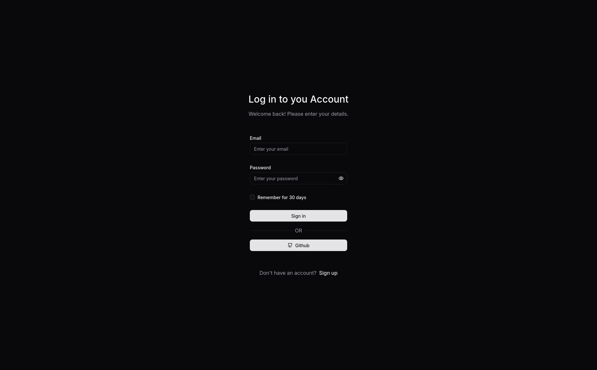
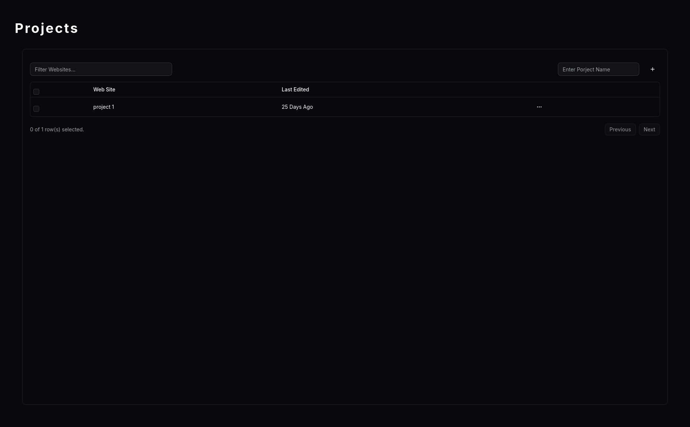
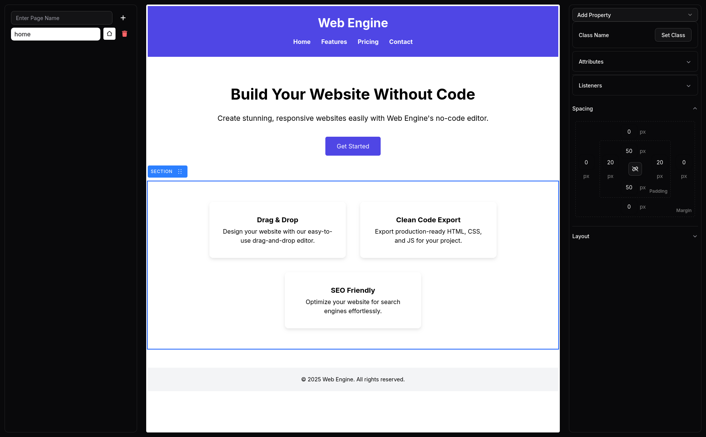
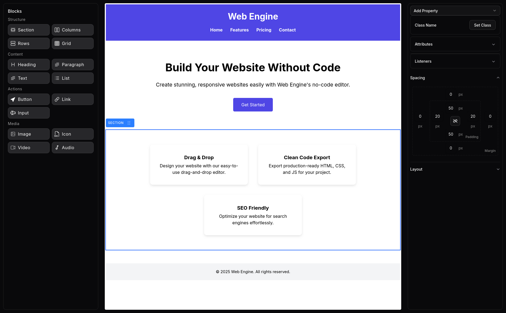
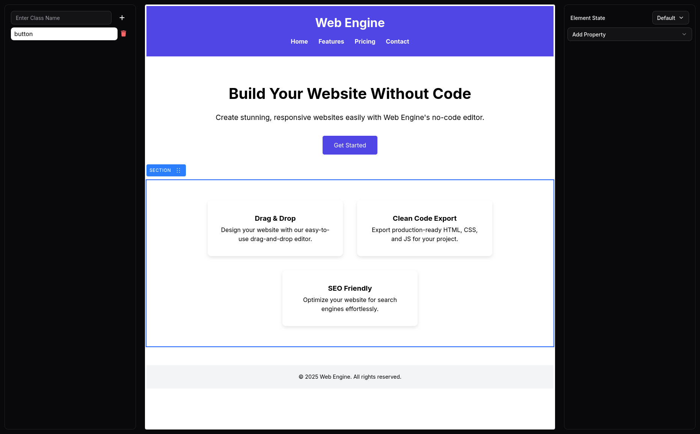
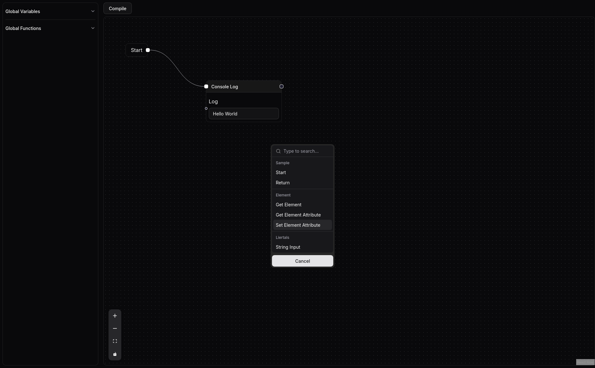

# 🌐 Web Engine — No-Code Website Builder

**Web Engine** is a powerful no-code platform that allows users to build complete websites visually, without writing any code.  
It generates production-ready HTML, CSS, and JavaScript, allowing non-developers to create, customize, and publish web pages with ease.

---

## 🚀 Features

-   ⚡ Drag-and-drop editor
-   🎨 Live preview of website changes
-   🖥️ Exports clean HTML, CSS, and JavaScript code
-   💾 Save and load projects
-   🔒 User authentication
-   🔌 Backend integrations

---

## 🛠 Tech Stack

-   **Frontend:** React.js, Next.js, Tailwind CSS
-   **Backend:** Express
-   **Database:** MongoDB
-   **Authentication:** NextAuth.js
-   **Deployment:** Vercel

---

## 📸 Demo Preview










---

## 🔧 Installation (Local Development)

```bash
# Clone the repository
git clone https://github.com/Syed-Ashiq-AP/web-engine-main.git

# Navigate into the project directory
cd web-engine-main

# Install dependencies
npm install

# Run the development server
npm run dev
```
